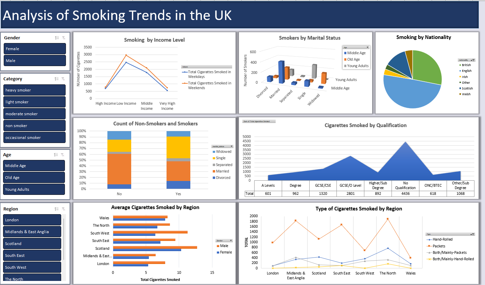

# Analysis of Smoking Data in the UK

## Project Overview
This project involves the analysis of smoking data in the UK, aiming to understand trends, patterns, and insights related to smoking habits. The analysis is performed using Excel, with various stages including data cleaning, creating pivot tables, generating charts, and building an interactive dashboard.

## Files Included

- `Smoking_Data_UK_Raw.xlsx` : The raw data file containing the original, unprocessed smoking data in the UK.
- `Smoking_Data_UK_Formatted.xlsx`:This file includes the cleaned data, pivot tables and charts created during the analysis.
- `Dashboard_Smoking_Data_UK.xlsx`: This file contains the final interactive dashboard summarizing key insights from the analysis.
  
## EXCEL Dashboard
Dashboard_Screenshots.png: Visual snapshots of the dashboard for a quick overview.

